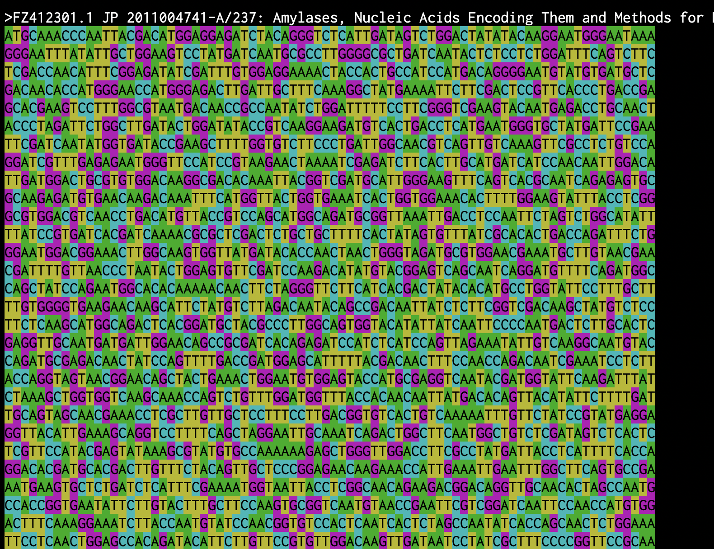
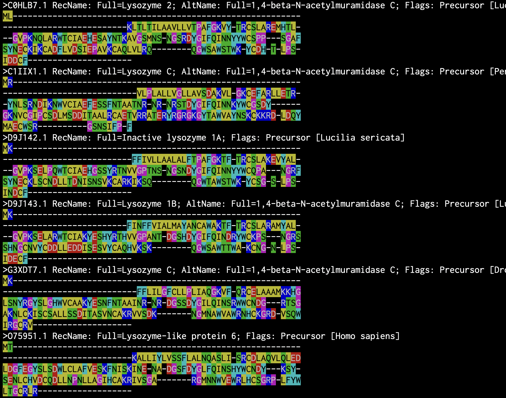

# colorize-fasta
A small program colorizing sequences in FASTA format.

## Compilation 

You can compile this program by using `Cargo`. 🦀📦 

[e.g.] 

``` 
% cd colorize-seq 
% cargo build --release
``` 

Then, the object file is generated in `./target/release/` directory.

## Usage 

Available options : 

* `-i` : Input filename in FASTA format, REQUIRED. 
* `-w` : Window size, default 80. 
* `-s` : Input sequence type, ( `dna` or `aa`, default `dna` ). 
* `-t` : Tolerate non-standard symbols (such as -, N, B, Z and X) in input file ( `yes` or `no`, default `yes` ). 
* `-h` : Print this help, ignore all other arguments. 

[e.g] 

```
% ./colorize-seq -i input.fasta -w 80 -s aa 
``` 

## Output 

Colorized sequences are displayed on your Terminal. 

[e.g.] 

 

 

Enjoy. 
